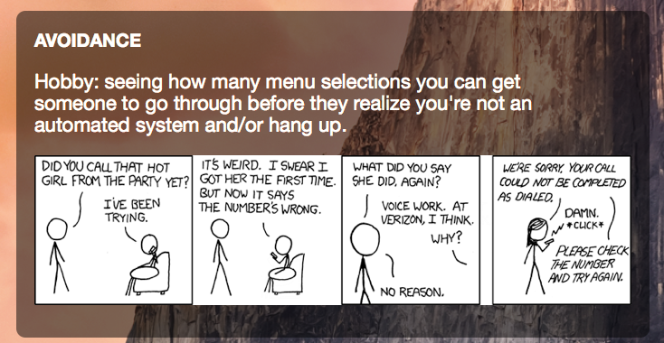

# xkcd-random.widget

## Screenshot

## Description
Übersicht widget to shows a random xkcd comic every 10 min and alt text.
Made for [Übersicht](http://tracesof.net/uebersicht/)
Übersicht is awesome for your OSX desktop.

## Sources
Help by : <a href="https://github.com/Cajova-Houba">Cajova-Houba</a>
Fork from : <a href="https://github.com/dalemanthei/uebersicht-widgets/tree/master/xkcd">dalemanthei/uebersicht-widgets/xkcd/ on Github</a>
Style based on DiskUsage-Bar-Widget : <a href="https://github.com/dinever/DiskUsage-Bar-Widget">Sources on Github</a>

